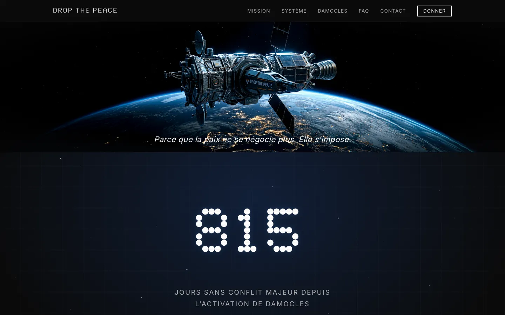

# Drop the Peace

A design-fiction website for a fictional private company that has deployed an AI-controlled orbital weapon, DAMOCLES, to enforce automated, proportional retaliation against any nation that starts a war.



Live site: https://studioflower-fr.github.io/dropthepeace/

## What it does

- Presents "Drop the Peace" as a legitimate, corporate non-profit through 7 static pages: home, mission, how it works, DAMOCLES, FAQ, contact, and a donation page.
- DAMOCLES is framed as an automated law-of-retaliation system: any military aggression triggers a proportional strike, with no human in the loop, named after the Sword of Damocles.
- Home page shows a live-counting "days without major conflict" counter and a satellite hero visual.
- Donation page ("Financer la Paix") lists fictional sponsorship tiers.
- Fully static: no backend, no build step, no framework — vanilla HTML, CSS and JavaScript only.
- Includes a supporting research document (`AI_Peace_War_Research.md`) on AI as a factor in the peace/war balance, used as grounding for the fiction.

## Tech stack

HTML5, CSS3 (custom properties, no preprocessor), vanilla JavaScript. No dependencies, no package manager, no build tool.

## Run locally

```bash
cd site
python3 -m http.server 8000
```

Then open `http://localhost:8000/` in a browser.

## Context

Design-fiction project for Audencia Business School. The goal is to provoke a debate on the privatization of peace and the delegation of lethal decisions to an AI, by presenting an ethically loaded premise through the lens of a slick, reassuring corporate website — the visitor is left to judge for themselves. Elouan Begue designed and built the site (concept, copy, and code).

## License

Code: MIT (see [LICENSE](LICENSE)). The "Drop the Peace" fiction, its narrative copy, and the images/visuals remain All rights reserved.
